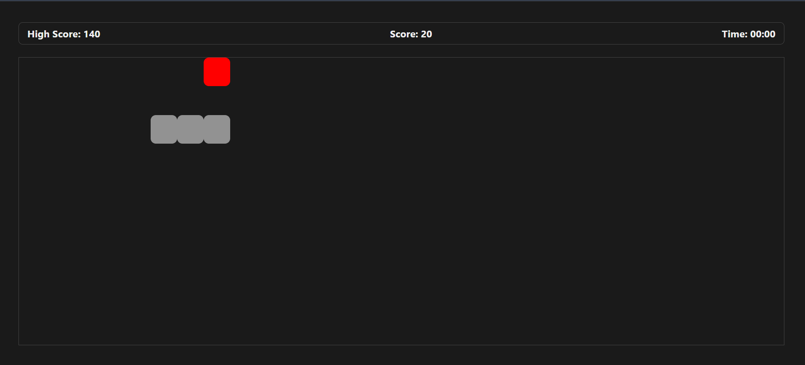

# 🐍 Snake Game (JavaScript)

A classic Snake Game built using **vanilla JavaScript, HTML, and CSS**.
Control the snake, eat food, grow longer, and try to beat your high score!

---

## 🎮 Demo

Play the game locally in your browser (no installation required).

---

## 📌 Features

* 🎯 Smooth snake movement using arrow keys
* 🍎 Random food generation
* 📈 Score tracking system
* 🏆 High score saved using **localStorage**
* 💥 Collision detection:

  * Wall collision (Game Over)
  * Self collision (Game Over)
* ⚡ Fast and lightweight (no libraries used)

---

## 🕹 Controls

| Key            | Action     |
| -------------- | ---------- |
| ⬅️ Arrow Left  | Move Left  |
| ➡️ Arrow Right | Move Right |
| ⬆️ Arrow Up    | Move Up    |
| ⬇️ Arrow Down  | Move Down  |

---

## ⚙️ How It Works

* The board is divided into a grid of blocks
* Snake moves continuously in the selected direction
* Food appears randomly on the board
* Eating food increases snake length and score
* Game ends if:

  * Snake hits the wall
  * Snake collides with itself

---

## 📸 Screenshot





---

## 📂 Project Structure

```bash
snake-game/
   index.html
   style.css
   script.js
```

---

## 🚀 How to Run

1. Download or clone this repository
2. Open `index.html` in your browser
3. Start playing 🎮

---

## 🛠 Tech Stack

* HTML
* CSS
* JavaScript (Vanilla JS)

---

## 💡 Future Improvements

* Pause / Resume functionality
* Mobile touch controls
* Difficulty levels (speed control)
* Sound effects
* Restart button

---

## 👨‍💻 Author

**Smit Jadav**

---

## ⭐ Support

If you like this project, give it a ⭐ on GitHub!
